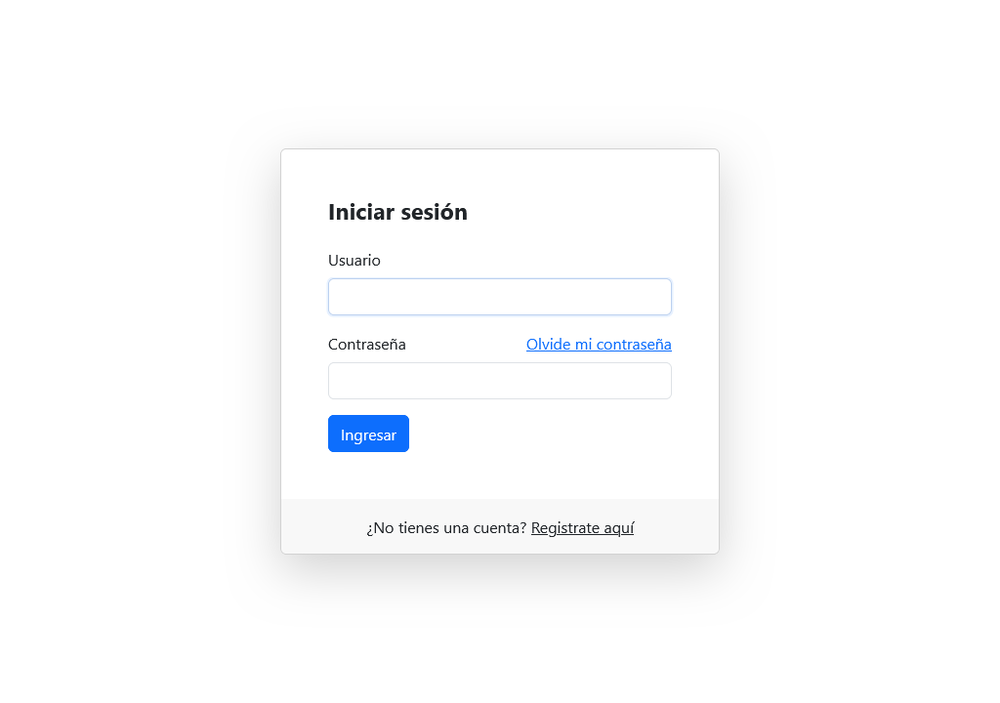
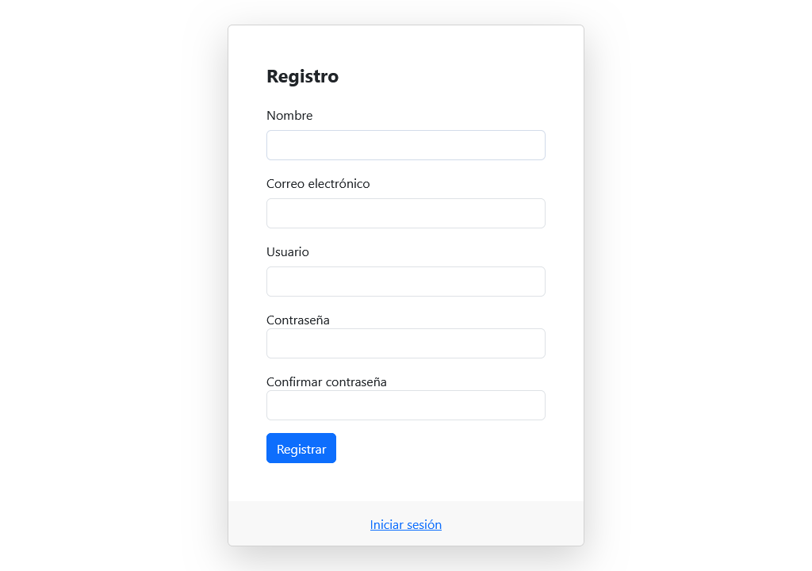
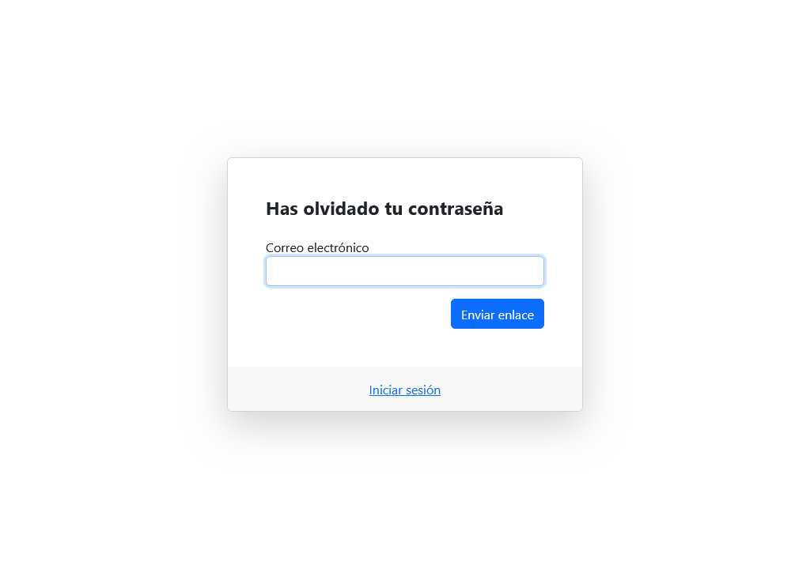
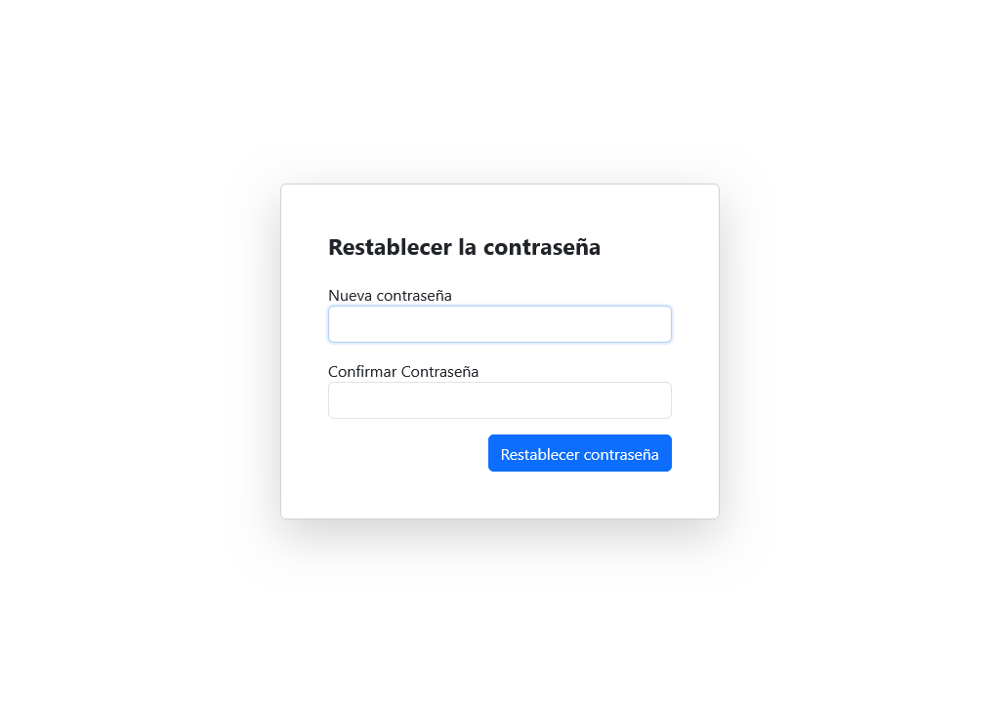

# Plantillas Sistema de Usuarios con Bootstrap

Este proyecto proporciona un conjunto de plantillas de interfaz de usuario (UI) para un sistema de autenticación de usuarios. Las plantillas están diseñadas utilizando Bootstrap, lo que asegura un diseño atractivo, responsivo y fácil de personalizar.

## Requisitos

Asegúrate de tener acceso a internet durante el desarrollo, ya que Bootstrap se carga desde un CDN.

## Uso

1. Clona este repositorio:

    ```bash
    git clone https://github.com/mroblesdev/plantillas-sistema-usuarios-bootstrap.git
    ```

2. Abre el archivo `login.html` en tu navegador web.

3. Personaliza según las necesidades de tu proyecto.

## Estructura del Proyecto

```
plantillas-sistema-usuarios-bootstrap/
|-- css/
|   |-- style.css
|-- link_request.html
|-- login.html
|-- register.html
|-- reset_password.html
```

- `css/`: Carpeta que contiene los archivos CSS necesarios, como un archivo de estilo personalizado (estilo.css).
- `link_request.html`: Página para solicitar un enlace de restablecimiento de contraseña.
- `login.html`: Página de inicio de sesión para que los usuarios puedan acceder a sus cuentas.
- `register.html`: Página de registro para que los nuevos usuarios puedan crear una cuenta.
- `reset_password.html`:  Página para restablecer la contraseña utilizando el enlace recibido.

## Capturas

| [<br><sub>login.html</sub>](login.html) |  [<br><sub>register.html</sub>](register.html) |
| :---: | :---: |
| [<br><sub>link_request.html</sub>](link_request.html) |  [<br><sub>reset_password.html</sub>](reset_password.html) |


## Tecnologías utilizadas


## Contribuciones

Siéntete libre de contribuir al proyecto.

## Licencia

Este proyecto está bajo la Licencia [MIT](LICENSE).